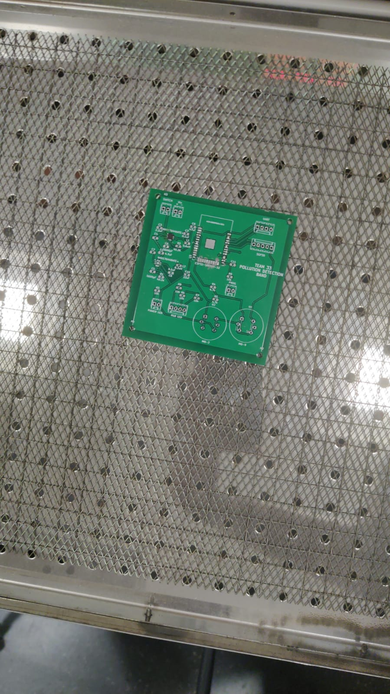
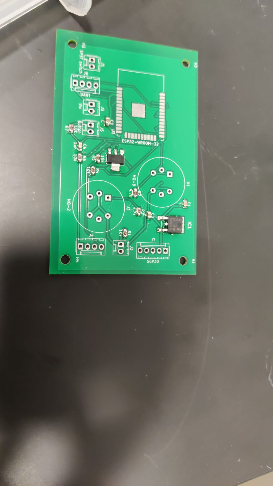
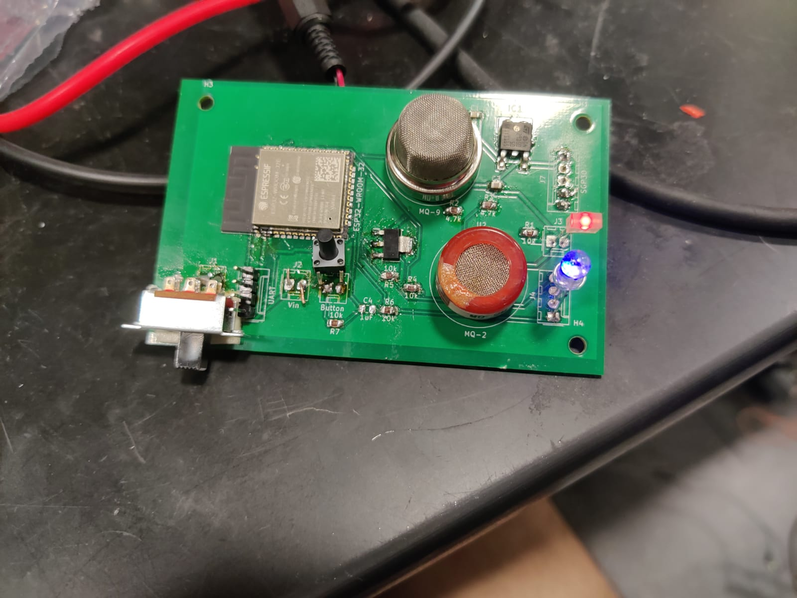
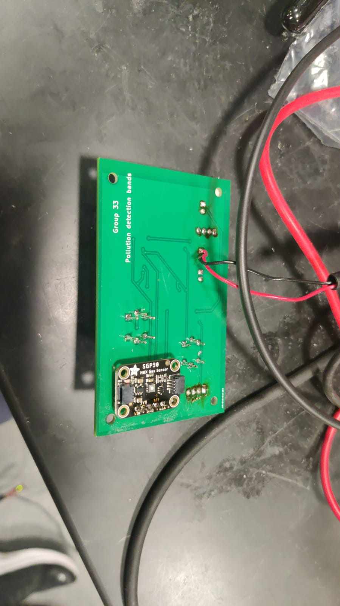
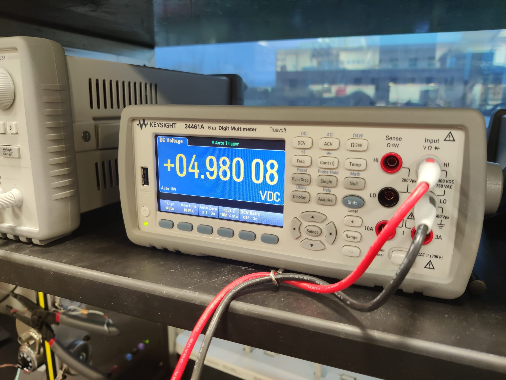
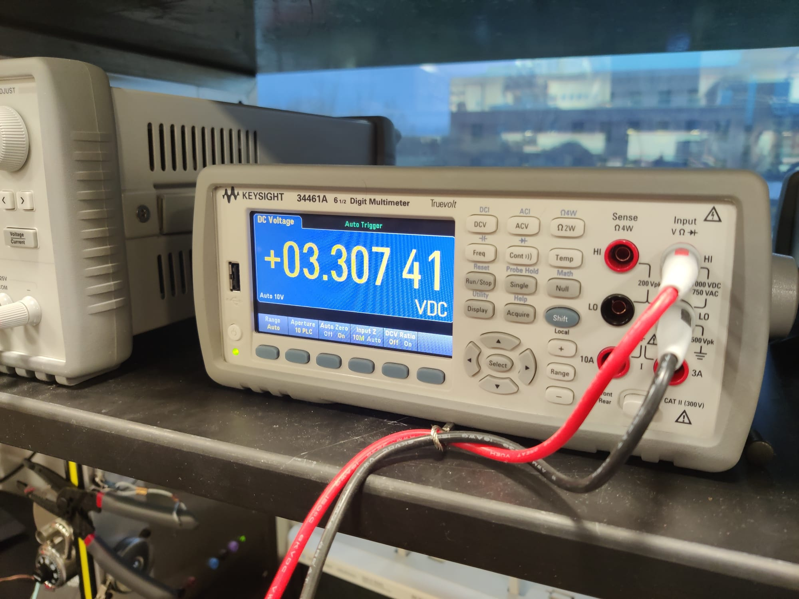
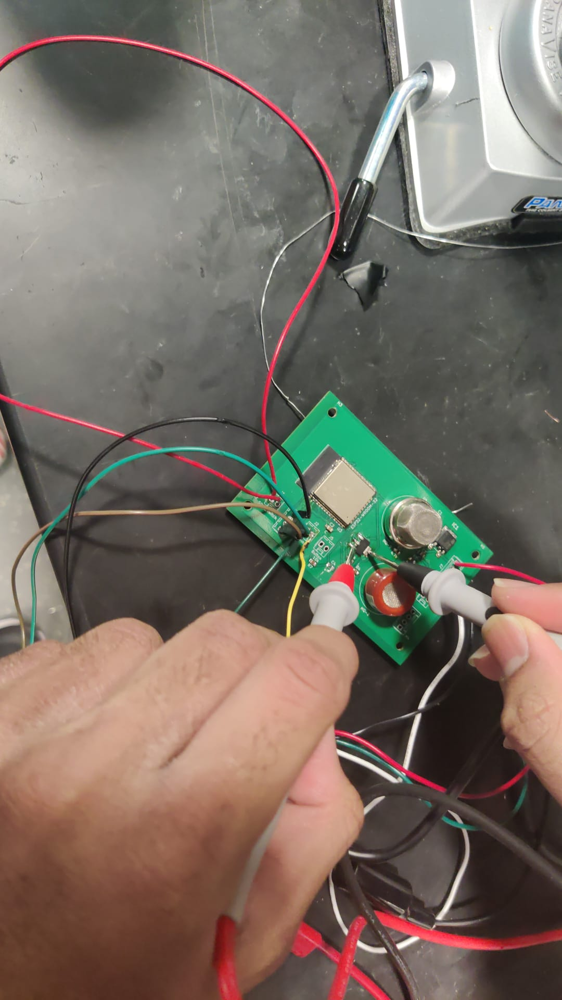
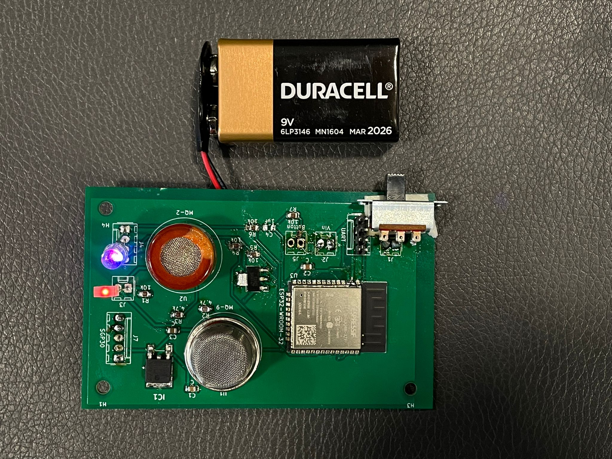
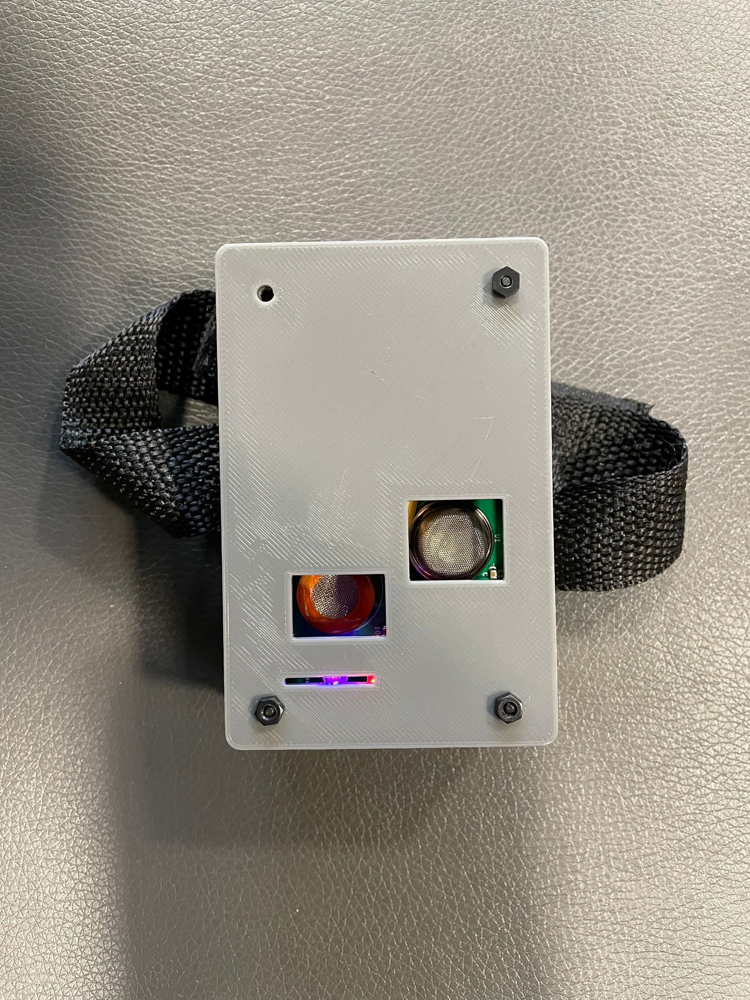

<h1>Vatsin's Workflow</h1>

<h2>Week of 02/21/2022</h2>

Final decision on parts and design for first iteration. We decided to go with buck converter design for high efficiency. Verified voltage and current requirements of the system and if the regulators can meet the demand.

<h2>Week of 02/28/2022</h2>

Routing and positioning of components on PCB.

<h2>Week of 03/21/2022</h2>

Made changes to circuit to use Low DropOut(LDO) Regulators instead of buck converter. This is because when the parts arrived we realized that the size of parts is too small to solder even with a reflow oven. Another benefit of LDOs is that we can reach our specified high level length and width requirements. This is because while they are considerably bigger than buck converters, they do not need any passive components around them unlike the buck converter. Prepared circuits before 2nd round PCB order.

<h2>Week of 03/28/2022</h2>

Learned using reflow oven. As we had extra PCBs from first round that we decided to not use, that PCB was perfect for practicing the reflow oven. 

As seen in this photo, I soldered a tiny buck converter in place to get an idea of how soldering using reflow oven works. While there were a lot of bad connections for this particular device because of its size, bigger components were much easier to solder in place.

<h2>Week of 04/04/2022</h2>

FInished soldering of the entire PCB during this week. First, I put the power subsystem on and quickly tested it.

As the voltage levels looked correct, I soldered on the rest of the board. Here is a front view:

Here is the back view:

<h3>NOTE: Board so far is powered by lab bench supply</h3>

<h2>Week of 04/11/2022</h2>

Tested various systems on the board. First, the power subsystem. We verified the working of our voltage regulators over 30 minutes. The result of the test is shown in the two figures below. 

The setup for this test is:

<h2>Week of 04/18/2022 and 04/25/2022</h2>

Finally connected the battery:

And assembled our 3d printed case:

At last, tested the whole system in the real world. Walked around collecting data around the campus.
